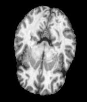

# Multi Disease Classification

This project demonstrates image classification for the multi_desease using deep learning techniques with TensorFlow.

## Dataset
The "multidisease" dataset from Kaggle Datasets is used for training and evaluation. It consists of images of MRI scans of multiple organ. The dataset is split into training, validation, and test sets.

## Requirements
- TensorFlow
- kaggle.json
- Matplotlib
- Pandas
- Operating system

## Usage
1. Clone the repository:
- git clone <repository_url>

2. Install the required dependencies:
-pip install kaggle, kaggle-datasets ,matplotlib ,pandas ,tansorflow

3. Run the script: multidiseasedataset

4. Training Process
- The script loads the dataset and performs data preprocessing.
- A convolutional neural network model based on InceptionV3 is defined.
- The model is trained on the training set with validation performed on the validation set.
- Training progress, including accuracy and loss, is displayed.

5. Evaluation
- The trained model is evaluated on the test set.
- Test accuracy and loss are reported.

6. Saving the Model
- The trained model is saved to the "multidiseasedataset" directory.

## Files
- `multidiseasedataset`: The main Python script for training and evaluating the model.
- `README.md`: This file providing detailed information about the project.
- `multidiseasedataset/`: Directory containing the saved model.

## License
This project is licensed under the [MIT License](LICENSE).

#Address info
-Anugrah Purohit [anugrahpurohit130703@gmail.com](email)